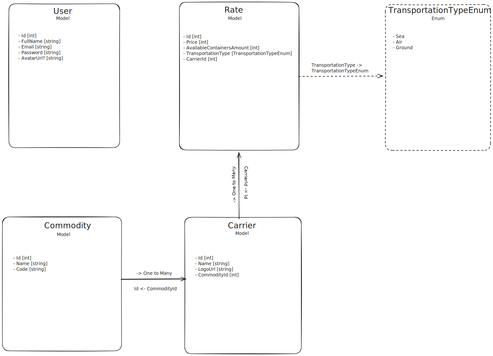

# ⛴ Worldwide Freight

Simple ASP.NET Core Web API for working with .csv files.

## ▶️ Installation and Running

1. Clone the repository:

   ```bash
   git clone https://github.com/AlbertArakelyan/WorldwideFreight
   ```
   
2. Navigate to the project directory:

   ```bash
   cd WorldwideFreight
   ```
   
3. Restore the NuGet packages:

   ```bash
   dotnet restore
   ```

4. Update the connection string in appsettings.json to point to your SQL Server database.
5. Run the database migrations to create the necessary tables:
    
    ```bash
    dotnet ef database update
    ```
   
6. Start the application:

    ```bash
    dotnet run
    ```
   
_Or just simply run **from your IDE** (e.g. Visual Studio)_

⚙️ The development server starts on `http://localhost:xxxx`

_*Note: If Entity Framework is not installed globally, then install it with the following command_
```bash
  dotnet tool install --global dotnet-ef
```

_* You can open Swagger documentation at `http://localhost:xxxx/swagger/index.html`_

## 👨🏻‍💻 Database Structure



## 📚 What you will learn?
- How to create a simple ASP.NET Core Web API.
- How to use Entity Framework Core for database operations.
- How to implement basic CRUD operations in a Web API.
- How to handle user authentication and authorization in ASP.NET Core with JWT.
- How to work with .csv files in C#.

---

Made with ❤️ by [Albert Arakelyan](https://github.com/AlbertArakelyan) <br>
https://www.albertarakelyan.com